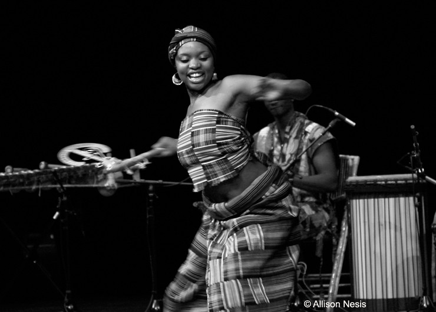

# DAN 1025: Dance Appreciation

Course materials, organized by unit and week.  
See the [syllabus](syllabus.md) for the full course outline.

## Unit 1 — Introduction to Dance as a Cultural and Artistic Form (Week 1)
- [Sway 1: Dance as a Cultural and Artistic Form](modules/sway-01.md)
- [Sway 2: Exploring Dance Genres and Cultural Influences](modules/sway-02.md)

## Unit 2 — Understanding the Roles in Dance (Week 2)
- [Sway 3: The Choreographer & Dancer](modules/sway-03.md)
- [Sway 4: Dance & The Audience](modules/sway-04.md)

## Unit 3 — The Value of Dance Genres in Society, History, and Culture (Week 3)
- [Sway 5: Dance Genres as Cultural Reflections](modules/sway-05.md)
- [Sway 6: Dance as a Cultural Shaper and Mirror](modules/sway-06.md)

## Unit 4 — Dance Genres and Movement Styles (Weeks 4–5)
- [Sway 7: Introduction to Dance Genres & Performance Dance](modules/sway-07.md)
- [Sway 8: Social Dance and Introduction to Somatic Practices](modules/sway-08.md)
- [Sway 9: World Dance Traditions](modules/sway-09.md)
- [Sway 10: Postmodern and Experimental Dance](modules/sway-10.md)

## Unit 5 — Language of Dance and Principles of Movement (Week 6)
- [Sway 11: Language of Dance and Anatomy of Movement](modules/sway-11.md)
- [Sway 12: Elements of Dance](modules/sway-12.md)

## Unit 6 — Reflection and Critique of Dance Performances (Week 7)
- [Sway 13: Introduction to Dance Critique](modules/sway-13.md)
- [Sway 14: Interpretation, Evaluation, and Contextualization](modules/sway-14.md)

*Midterm — Week 8*

## Unit 7 — Specific Genres (Weeks 9–11)
- [Sway 15: Ballet](modules/sway-15.md)
- [Sway 16: Modern & Contemporary Dance](modules/sway-16.md)
- [Sway 17: Jazz and Tap](modules/sway-17.md)
- [Sway 18: Hip Hop](modules/sway-18-hip-hop.md)

## Unit 8 — Dance in Society and Cultural Perspectives (Week 12)
- [Sway 18/19: Dance as Cultural Expression](modules/sway-18-19-cultural-expression.md)

## Unit 9 — Choreography (Week 13)
- [Sway 20: Choreography](modules/sway-20.md)

## Unit 10 — Final Projects (Weeks 14–15)
No readings — final project presentations and course wrap-up.

---

[Full source list](sources.md)
